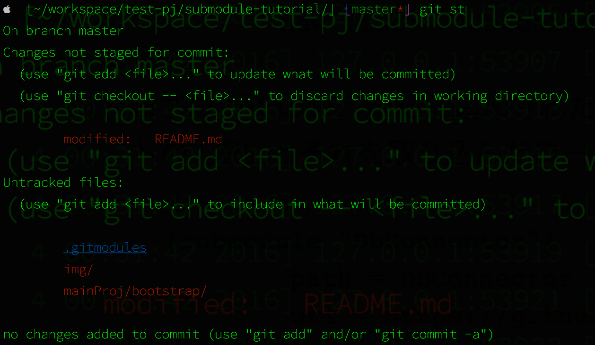

# GIT SUBMODULE TUTORIAL

## WHY
In my project, we have to use git submodule. But I dont have any experience of using git submodule.
So I want to try this kind of technology and I want to know how this works.

## HOW
Include bootstrap as submodule project and see how PR works.

## PROCESS USE OF SUBMODULE
1. create project
2. `git submodule add https://github.com/twbs/bootstrap`  
  which means `git submodule add ${project git url}`
3. `git st` result is looks like this   

		
